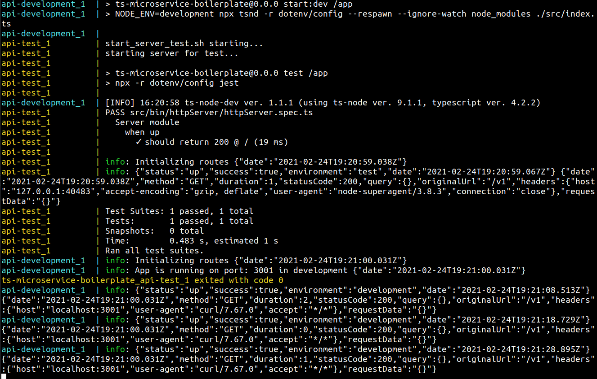

# ts-microservice-boilerplate

## Features

- [x] TypeScript
- [x] Docker
- [x] Tests - `jest` and `supertest`
- [x] Module Alias - ex: '@config/foo' instead '../../../../config/foo'
- [x] Environment variables management with dotenv
- [x] Logger - Using `winston` to padronize and format logs. For now, logs will only be transported to console.
- [x] Express - Basic middlewares (XSS, Helmet, Bodyparser), basic headers (CORS, disable x-powered-by), health check route, http server and requests logs. 
- [x] CI - Github Actions running tests on push in any branch.
- [ ] Example route
- [ ] Auth
- [ ] Code coverage >= 95%

## To run the project

Docker compose will install dependencies and up both dev and test environments:

`sudo docker-compose up`

### If you prefer to not use Docker:

First install the dependencies:

`npm install`

In development run:

`npm run start:dev`

To test:

`npm test`

To reload tests when code changes:

`npm test:watch`
